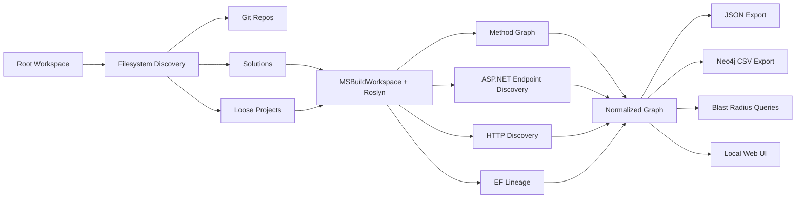

# dede

`dede` is a static dependency and blast-radius explorer for mixed .NET workspaces with many sibling repositories. The codebase and namespaces remain `DogEatDog.DependencyExplorer`; the CLI entry point is `dede`.

It scans a root folder, discovers Git repos, solutions, and loose projects, loads C# projects through Roslyn, and emits a normalized graph for:

- workspace topology
- controllers and minimal APIs
- methods, interfaces, implementations, and DI links
- `HttpClient` and `IHttpClientFactory` calls
- `DbContext`, entities, and table lineage
- cross-repo boundaries
- explicit ambiguous and unresolved edges

## Status

Current vertical slice is demoable.

- Full multi-project solution scaffolded
- Root-folder scanner working across sibling repos
- Roslyn-backed project loading and method graph extraction in place
- ASP.NET controller and minimal API discovery implemented
- HTTP call discovery and cross-repo boundary inference implemented
- EF Core lineage extraction implemented
- JSON export, Neo4j CSV export, CLI, local web host, and UI implemented
- Deterministic unit and integration tests added with a self-contained fixture workspace

Known limitations:

- Exact downstream endpoint resolution for service-to-service HTTP is still heuristic. Cross-repo boundary edges are emitted reliably; `RESOLVES_TO_SERVICE` is conservative.
- EF table naming can still fall back to entity-name inference on some patterns; uncertainty is preserved through certainty classes and graph edges.
- Conventional MVC routes without clear attributes are only partially inferred.
- The UI is a lightweight local demo surface, not yet a polished operations console.

## Quickstart

### 1. Scan a workspace

```bash
dotnet run --project src/DogEatDog.DependencyExplorer.Cli -- scan ./ -o ./graph.json
```

`dede` automatically loads a `.dedeignore` file from the scan root if one exists. This repo includes a default [`.dedeignore`](.dedeignore) so scanning the workspace root is usable without a long `--exclude` list.

For large mixed workspaces, keep exclusions in `.dedeignore` and only add one-off CLI excludes when needed:

```bash
dotnet run --project src/DogEatDog.DependencyExplorer.Cli -- scan ./ -o ./graph.json \
  --exclude platform/runtime/src/native
```

### 2. Keep the graph fresh automatically

```bash
dotnet run --project src/DogEatDog.DependencyExplorer.Cli -- watch ./ -o ./graph.json
```

`watch` does an initial scan, writes `graph.json`, then rescans when `.cs`, `.csproj`, `.sln`, `.props`, `.targets`, `.json`, `.xml`, or `.dedeignore` files change. It honors `.dedeignore`, supports `--exclude-file`, and uses debounce so save storms collapse into one rescan.

### 3. Serve the graph locally

```bash
dotnet run --project src/DogEatDog.DependencyExplorer.Cli -- serve ./graph.json --url http://127.0.0.1:5057
```

Open `http://127.0.0.1:5057`.

### 4. Export JSON or Neo4j CSV

```bash
dotnet run --project src/DogEatDog.DependencyExplorer.Cli -- export json ./ -o ./graph.json
dotnet run --project src/DogEatDog.DependencyExplorer.Cli -- export neo4j ./ -o ./neo4j
```

### 5. Run blast-radius queries from the CLI

```bash
dotnet run --project src/DogEatDog.DependencyExplorer.Cli -- query impact --graph ./graph.json --node "GET /api/Orders/{id}"
dotnet run --project src/DogEatDog.DependencyExplorer.Cli -- query paths --graph ./graph.json --from "GET /api/Orders/{id}" --to "orders"
```

## CLI

```text
dede scan <rootPath> [-o graph.json] [--exclude-file <path> ...] [--exclude <path> ...]
dede watch <rootPath> [-o graph.json] [--debounce-ms 1500] [--exclude-file <path> ...] [--exclude <path> ...]
dede serve <graphJsonPath> [--url http://127.0.0.1:5057]
dede export json <rootPath> -o <file> [--exclude-file <path> ...] [--exclude <path> ...]
dede export neo4j <rootPath> -o <folder> [--exclude-file <path> ...] [--exclude <path> ...]
dede query impact --node <id or name> [--graph graph.json]
dede query paths --from <node> --to <node> [--graph graph.json]
```

`.dedeignore` and `--exclude-file` accept one path pattern per line, with `#` comments allowed. `--exclude` accepts repeated relative paths under the scan root or absolute paths. All three use the same simple path-prefix matching rules.

## Demo Flow

For a brutal demo on a large workspace:

1. Clone many repos into one folder, including mixed repo types like `tools/roslyn`, `platform/aspnetcore`, service repos, and data-heavy repos.
2. Run `dede scan ./`.
3. Start the UI with `dede serve ./graph.json`.
4. In the UI, walk these views:
   - `Workspace topology`
   - `Service/API dependencies`
   - `Cross-repo map`
   - `Unresolved audit`
5. Use presets:
   - `Show Cross-Repo Dependencies`
   - `Show All Downstream Dependencies of an Endpoint`
   - `Show Ambiguous Edges Requiring Human Review`

The included fixture workspace under [tests/Fixtures/MultiRepoWorkspace](tests/Fixtures/MultiRepoWorkspace) is a synthetic deterministic smoke-test demo, not a bundled copy of external repositories.

## Agent Skills

The reusable agent skill ships in [skills/dede](skills/dede).

- `SKILL.md` provides the shared workflow for Codex, Claude Code, OpenCode, and GitHub Copilot.
- `scripts/run-dede.sh` wraps the local CLI so agents can invoke `dede` without a global install.
- `scripts/install-all-agents.sh` creates repo-local and home-directory symlinks for the major agent runtimes.

Install locally from the repository root:

```bash
./skills/dede/scripts/install-all-agents.sh "$(pwd)"
```

## Architecture



More detail: [docs/architecture.md](docs/architecture.md)

## Solution Layout

- [src/DogEatDog.DependencyExplorer.Cli](src/DogEatDog.DependencyExplorer.Cli)
- [src/DogEatDog.DependencyExplorer.Core](src/DogEatDog.DependencyExplorer.Core)
- [src/DogEatDog.DependencyExplorer.Graph](src/DogEatDog.DependencyExplorer.Graph)
- [src/DogEatDog.DependencyExplorer.Roslyn](src/DogEatDog.DependencyExplorer.Roslyn)
- [src/DogEatDog.DependencyExplorer.AspNet](src/DogEatDog.DependencyExplorer.AspNet)
- [src/DogEatDog.DependencyExplorer.HttpDiscovery](src/DogEatDog.DependencyExplorer.HttpDiscovery)
- [src/DogEatDog.DependencyExplorer.EFCore](src/DogEatDog.DependencyExplorer.EFCore)
- [src/DogEatDog.DependencyExplorer.Export](src/DogEatDog.DependencyExplorer.Export)
- [src/DogEatDog.DependencyExplorer.WebApi](src/DogEatDog.DependencyExplorer.WebApi)
- [src/DogEatDog.DependencyExplorer.WebUi](src/DogEatDog.DependencyExplorer.WebUi)
- [tests/DogEatDog.DependencyExplorer.UnitTests](tests/DogEatDog.DependencyExplorer.UnitTests)
- [tests/DogEatDog.DependencyExplorer.IntegrationTests](tests/DogEatDog.DependencyExplorer.IntegrationTests)

## Output Schema

The canonical graph JSON contains:

- `nodes[]`
- `edges[]`
- `scanMetadata`
- `warnings[]`
- `unresolved[]`
- `statistics`

Each node and edge carries:

- stable `id`
- normalized `type`
- `displayName`
- `sourceLocation`
- `repositoryName`
- `projectName`
- `certainty`
- metadata dictionary

## Screenshot Instructions

1. Start the UI with a real workspace graph.
2. Capture:
   - summary tiles + workspace topology
   - an endpoint drill-down with side metadata
   - the cross-repo map
   - the unresolved audit view
3. Save the images under `docs/screenshots/` when you want to freeze a demo pack.

## Verification

Verified locally in this workspace:

- `dotnet build DogEatDog.DependencyExplorer.sln`
- `dotnet test DogEatDog.DependencyExplorer.sln`
- `dotnet run --project src/DogEatDog.DependencyExplorer.Cli -- scan tests/Fixtures/MultiRepoWorkspace -o /tmp/dede-fixture.json`
- `dotnet run --project src/DogEatDog.DependencyExplorer.Cli -- scan ./ -o /tmp/dede-large.json`
- manual smoke: `watch` on the fixture workspace and touch a `.cs` file to confirm a rescan
- `dotnet run --project src/DogEatDog.DependencyExplorer.WebApi -- --graph /tmp/dede-fixture.json --url http://127.0.0.1:5067`
- `curl http://127.0.0.1:5067/api/summary`

## License

[MIT](LICENSE)
