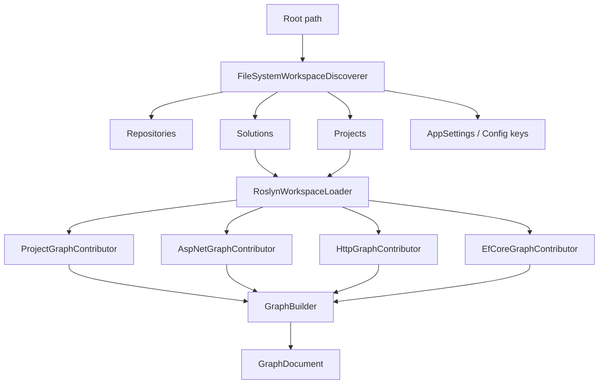
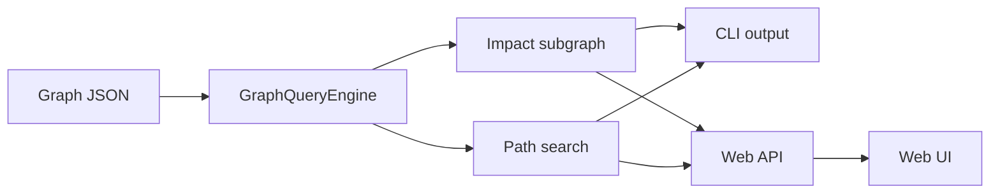

# Architecture

## Scan Pipeline

## Query Flow

## Notes

- `Core` owns scan options, certainty classes, discovery records, and filesystem scanning.
- `Graph` owns the normalized schema, graph builder, and blast-radius query engine.
- `Roslyn` owns MSBuild/Roslyn loading, symbol identity, topology wiring, and base method graph extraction.
- `AspNet`, `HttpDiscovery`, and `EFCore` add specialized contributors on top of Roslyn compilations.
- `Export` owns JSON and Neo4j-oriented CSV export.
- `WebApi` hosts scan/load/query endpoints and serves the UI.
- `WebUi` is a static web asset library consumed by `WebApi`.
